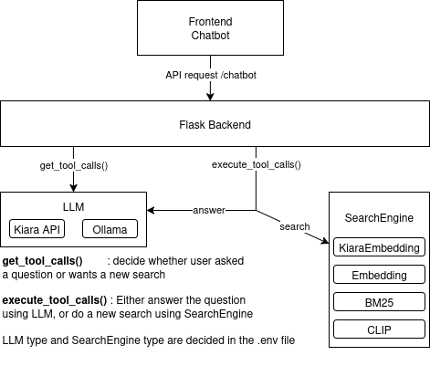

# CoLIBRi Conversational Search Microservice

This directory contains the containerized code for the CoLIBRI conversational search microservice. Make sure to change settings and set your credentials in a `.env` file (see below).

## Project Tools

The following tools are used:
* [Python 3.11](https://www.python.org/downloads/release/python-3110/)
* [gunicorn](https://gunicorn.org/)
* [Flask](https://flask.palletsprojects.com/en/stable/)
* [langchain](https://python.langchain.com/docs/introduction/)
* [llama-index](https://developers.llamaindex.ai/python/framework/)
* [ollama](https://github.com/ollama/ollama-python)

## Note on inference and environment files
We assume that you have an OpenAI-style API available to run this microservice, though some parts of the service may also work with a locally hosted Ollama instance.
Create a new `.env` file from `.env.sample`. Change to your credentials for the API service and change all settings accordingly:
* RETRIEVAL_METHOD=\{REMOTE, LOCAL\}: whether to run an embedding model locally (on cpu) or run a request to the API
* LOCAL_EMBED_MODEL={your_model_from_huggingface}: runs the embedding of the query on this model. We tried BAAI/bge-m3, but results were subpar
* LLM_TYPE=REMOTE=\{OLLAMA, REMOTE\}: type of LLM to use. "OLLAMA": local LLM served via Ollama, "REMOTE": LLM hosted at a remote LLM API
* if LLM_TYPE=OLLAMA
  * OLLAMA_URL=\{your_url_here\}
  * OLLAMA_MODEL=\{your_ollama_model\}
* if LLM_TYPE=REMOTE
  * REMOTE_URL=\{you_api_url_here\}
  * REMOTE_MODEL=\{your_model\}
  * REMOTE_EMBED_MODEL=\{your_embed_model\}
  * REMOTE_API_KEY=\{your_key_here\}

## Repository Setup

* `Dockerfile.cu[verion]`: Dockerfile(s) to build the Docker image for the conv-search microservice
* `entrypoint.sh`: Run on entry in the Docker Image
* `pyproject.toml`: Python configuration file for the microservice
  * Defines Python version 
  * Defines environment
  * Settings for ruff and bandit
* `.env.sample`: copy and change name to `.env` and change settings to run conv-search


## Application Structure



The flask endpoints for the backend are defined in `src/flask/backend.py`. 
All logic is handled by `src/flask/chatbot_logic.py`, which imports functions from `src/flask/search_engine.py` 

* Endpoints in `backend.py`:
  * `/retrieve`: query search engine using `data["query"]`
  * `/chatbot`: using `data["messages"]` and `data["technical_drawing_ids"]` create a message that describes the current retrieval results and the user message and send that to the LLM
* Search engine
  * when `/retrieve` is called with a query embedding, the search engine is queried
  * this is only for debugging and not really used during production
* Chatbot
  * has two data fields:
    * `data["messages"]`: history of messages, OpenAI style
    * `data["technical_drawing_ids"]`: list of technical drawing ids, that are currently displayed in the frontend (so retrieval results)
  * when `/chatbot` is called, the drawing ids are converted into text that describes the technical drawing using its features
  * afterwards, a tool_call is generated using pydantic and llama_index. this can be:
    * search_parts: the user wants a new query using some keywords
    * answer_question_about_previous_results: a natural language question about the current results is placed by the user
  * finally, the tool_calls are executed. In essence these are just different queries to the same backend LLM.
  * the chatbot responds with a new message history and potentially new drawing ids
* `chatbot_logic.py` contains the tools for generating tool_calls and executing them
* `search_engine.py` contains different search engines: one for a local embedding and one for remote embeddings

## Build the Application

### Running the service outside of Docker
This is possible, but not the recommended way of using the service. Using Docker will be much easier.

* Make sure you have [uv](https://docs.astral.sh/uv/guides/install-python/) installed!
* Generate a virtual environment using uv:
```
uv lock && uv sync --frozen --no-dev
```
* uv will use the defined packages in `pyproject.toml` to solve the environment and install necessary packages

After building the python environment using uv, you may use `uv run` to run any script in the virtual environment. Thus, run:
```
uv run gunicorn --bind "0.0.0.0:6201" --timeout 600 --chdir ./src/flask backend:app
```
to start the flask server. You may change the port in the --bind section to fit your needs.

### Build Service via Docker Compose as stand-alone
**Switch to the parent directory where the file `docker-compose.yml` is located.**

To build and run only the database and Spring application:
* `docker compose build convsearch-app`, to build the service
* `docker compose up -d convsearch-app` to start the convsearch microservice

To inspect the running containers:
* `docker compose ps -a`

To stop all running containers, remove the images and volumes:
* `docker compose down --rmi "all" -v`

### Build all Services via Docker Compose
`docker compose up -d` will run all microservices at once. This is the recommended way to run the whole system.
For a more detailed explanation, see the main ReadMe.md in the parent directory.


