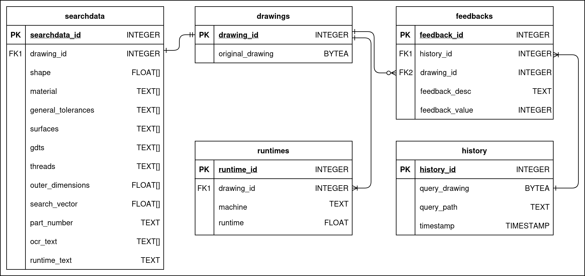

# Database Microservice

This directory contains the containerized code for the REST-based database application microservice.  
The application is based on the Spring Boot Framework.

## Project Tools

The following tools are used:
* [Java 21 - OpenJDK](https://openjdk.org/projects/jdk/21/)
* [Gradle 9](https://docs.gradle.org/current/userguide/userguide.html)
* [Spring Boot Framework 3.5](https://docs.spring.io/spring-boot/3.5/index.html)
* [Docker](https://www.docker.com/get-started/)
* [Docker Compose](https://docs.docker.com/compose/)

## Repository Setup

### Java

Install Java SE Platform version 21 on your system - best use OpenJDK - and make it available for this project, e.g., set `JAVA_HOME` environment variable.

### Project Configuration Files

* `gradlew`: Gradle Wrapper script, the recommended way to execute a Gradle build  
* `build.gradle`: Script for [Gradle build](https://docs.gradle.org/current/userguide/build_file_basics.html) configuration, tasks and plugins written in [Groovy DSL](https://docs.gradle.org/current/dsl/index.html)
* `settings.gradle`: [Entry point](https://docs.gradle.org/current/userguide/settings_file_basics.html) to Gradle project, used to add subprojects to the build
* `Dockerfile`: Dockerfile to build a Docker image for the Spring Boot application
* `docker-compose.yml`: Docker Compose file to set up services for a PostgreSQL database and the Spring 
  Boot application
* `initdb`: Folder with SQL initialization scripts for the PostgreSQL database used by the Docker Compose 
  file. Scripts get executed in order, so `1_script_name` gets executed before `2_script_name`.
* `resources`: Files loaded on databse setup to populate tables with example data 
* `config`: Configuration files for the Java development and automatic code analysis

#### Application Properties for Runtime

Runtime configuration for the Spring Boot application is done via `src/main/resources/application.properties`.  
Here, the database connection is configured via environment variables which are set by the Docker Compose 
file in the parwent directory.

#### Application Properties for Tests

The Spring Boot application can be configured for tests via the file `src/test/resources/application.properties`.  
Mostly used to configure the h2 in-memory database for test purposes.

## Application Structure

The Spring Boot application works on the following pattern, which is reflected by the according Java packages:

* **_Controller_**:
  * Exposing functionalities via REST interface, consumable by external applications
  * Calls de.scadsai.infoextract.service layer
* **_Service_**:
  * Business logic implementations
  * Called by de.scadsai.infoextract.controller layer
  * Calls de.scadsai.infoextract.repository layer to access data
* **_Repository_**
  * [CRUD](https://en.wikipedia.org/wiki/Create,_read,_update_and_delete) actions for data 
  * Works on connected datasource, e.g. [h2 in-memory](https://www.h2database.com/html/main.html) or [PostgreSQL](https://www.postgresql.org/docs/16/index.html)
  * Called by de.scadsai.infoextract.service layer

Data is handled via two concepts, also reflected by the according Java packages:

* **_Entities_**
  * Closely tied to the database schema and application domain-specific operations
  * Encapsulate and manage the state and behavior of the objects
* **_DataTransferObjects (DTO)_**
  * Act as pure data carriers without logic, best to be immutable
  * Used to transmit data between different applications, e.g. via REST

## Database Schema

## Local Development with Checks and Tests

### Checks

The following gradle plugins are used to check for code quality:
* [Checkstyle](https://docs.gradle.org/current/userguide/checkstyle_plugin.html) for Java code style checks
* [PMD](https://docs.gradle.org/current/userguide/pmd_plugin.html) for Java code quality and best practices
* [Spotbugs](https://spotbugs.readthedocs.io/en/stable/gradle.html) to find bugs in Java code

All check plugins can be executed from the projects' root via:
* `./gradlew clean check -x test`

The check results can be examined via the HTML report files created for 
* Checkstyle at
  * `build/reports/checkstyle/...`
* PMD at
  * `build/reports/pmd/...`
* Spotbugs at
  * `build/reports/spotbugs/...`

### Tests

All tests defined in `src/test/java` can be executed from the projects' root via
* `./gradlew clean test`

The test results can be examined via the HTML report file created at `build/reports/tests/test/index.html`

## Build the Application

### Java Build via Gradle

To build an executable JAR file, run the following command:
* `./gradlew clean build`

This will execute the build like configured in the `build.gradle` file, i.e. executing all checks, tests 
and the build. The resulting JAR file is put to `build/libs/database-{VERSION}.jar`

### Build Services via Docker Compose

**Switch to the parent directory where the file `docker-compose.yml` is located.**

To build and run only the database and Spring application:
* `docker compose build database spring-app`, to build the services
* `docker compose up -d database` to start the Postgres database service
* Wait unitl the database is up, running and all example tables are created
  * See the logs for any errors via `docker compose logs -f database`
  * Wait for "LOG:  database system is ready to accept connections"
* `docker compose up -d spring-app` to start the Spring application service
  * See the logs for any errors via `docker compose logs -f spring-app`

To inspect the running containers:
* `docker compose ps -a`

To stop all running containers, remove the images and volumes:
* `docker compose down --rmi "all" -v`

### REST API documentation

A Swagger-based REST API documentation for the Spring application is available at:
* `http://localhost:7001/swagger-ui.html`
