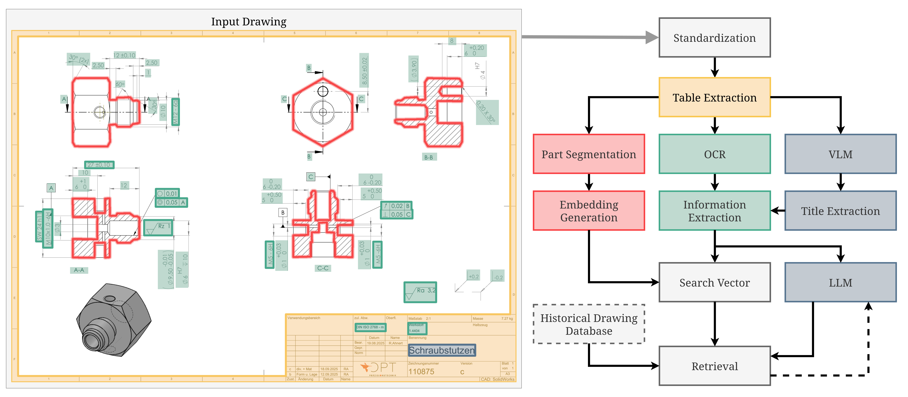

# CoLIBRi Preprocessor

This directory contains the containerized code for the CoLIBRI preprocessor microservice.

## Project Tools

The following tools are used:
* [Python 3.10](https://www.python.org/downloads/release/python-3100/)
* [OpenCV](https://docs.opencv.org/4.x/d6/d00/tutorial_py_root.html)
* [Scikit-Learn](https://scikit-learn.org/stable/)
* [Scikit-Image](https://scikit-image.org/)
* [Rapidfuzz](https://github.com/rapidfuzz/RapidFuzz)
* [Flask](https://flask.palletsprojects.com/en/stable/)
* [PaddleOCR](https://www.paddleocr.ai/main/en/quick_start.html)
* [pdf2image](https://pypi.org/project/pdf2image/)
* [Tesseract](https://pypi.org/project/pytesseract/)
* [nnunetv2](https://pypi.org/project/nnunetv2/)
* [clip](https://github.com/openai/CLIP.git)
* [gunicorn](https://gunicorn.org/)

## GPU and CUDA

An NVIDIA GPU is required to run this preprocessing service. The GPU should support at least CUDA 6.0 compute capabilities (see https://developer.nvidia.com/cuda-legacy-gpus). We recommend at least 10GB VRAM.

Ensure that the appropriate **NVIDIA GPU driver** and **NVIDIA Container Toolkit** are installed on your system, like desribed [here](https://docs.nvidia.com/datacenter/cloud-native/container-toolkit/latest/install-guide.html).

Select the appropriate Dockerfile for your available NVIDIA GPU, which needs to be specified in the project's [docker-compose.yml](https://github.com/ScaDS/CoLIBRi/blob/main/docker-compose.yml#L58) via the global environment file `.env`.

### Dockerfile.cu118
* For CUDA 11.8 with cuDNN 8.9
* Built based on [paddlepaddle Docker image](https://hub.docker.com/r/paddlepaddle/paddle) tagged "3.2.0-gpu-cuda11.8-cudnn8.9"
* Covers GPU architectures according to CUDA compute capabilities:
  * 6.0, 6.1, 7.0 - see https://developer.nvidia.com/cuda-legacy-gpus
  * 7.5, 8.0, 8.6 - see https://developer.nvidia.com/cuda-gpus

### Dockerfile.cu129
* For CUDA 12.9 with cuDNN 9.9
* Built based on [paddlepaddle Docker image](https://hub.docker.com/r/paddlepaddle/paddle) tagged "3.2.0-gpu-cuda12.9-cudnn9.9"
* Covers GPU architectures according to CUDA compute capabilities:
  * 12.0 - see https://developer.nvidia.com/cuda-gpus

## Repository Setup

* `Dockerfile.cu[verion]`: Dockerfile(s) to build the Docker image for the Preprocessor for you cuda version
* `entrypoint.sh`: Run on entry in the Docker Image
* `pyproject.toml`: Python configuration file for the Preprocessor
  * Defines Python version 
  * Defines environment
  * Settings for ruff and bandit

## Application Structure



The flask endpoints for the backend are defined in `src/flask/backend.py`. 
All logic is handled by `src/flask/preprocess.py`, which imports functions from 
* `src/flask/converter/`: contains the Standardization, Table Extraction and Part Segmentation steps
  * `consts.py`: important constants that work for our dataset. If you want to try this tool on you own dataset, changing some of these might me important (especially LINE_WIDTH).
  * `image_rotation.py`: tools for checking if image is rotated and correcting it
  * `image_std.py`: tools for converting bytestrings to cv2 images, deskewing, resizing/ padding images to 2048x2048
  * `shape_extract.py`: tools for removing dimensioning, arrows and lines as well as applying the UNet segmentation
  * `table_extract.py`: fire propagation algorithm for table detection
  * `thumb_gen.py`: deprecated, but can be used to generate a thumbnail for a drawing using either a representative view or a 3d render if it exists
* `src/flask/ocr/`: contains the OCR and Information Extraction steps
  * `paddle_ocr_engine.py`: initialize and apply OCR model to a drawing
  * `context_merger.py`: from the OCR results, merge text that is in a cell, or close to each other using DBSCAN
  * `extraction.py`: from the resulting text clusters, extract text features such as material, norms, surfaces etc.
  * `vectorizer.py`: convert those extracted features in to a searchable vector representation
* `src/flask/shapes/`: contains the Embedding Generation step
  * `vectorizer.py`: applies CLIP embedding to all views, selects the most representative one
* Title Extraction through the VLM is handled in conv-search microservice


## Build the Application

### Running the service outside of Docker
This is possible, but not the recommended way of using the service. Using Docker will be much easier.

* Make sure you have [uv](https://docs.astral.sh/uv/guides/install-python/) installed!
* Generate a virtual environment using uv:
```
uv lock && uv sync --frozen --no-dev
```
* uv will use the defined packages in `pyproject.toml` to solve the environment and install necessary packages

After building the python environment using uv, you may use `uv run` to run any script in the virtual environment. Thus, run:
```
uv run gunicorn --bind "0.0.0.0:6201" --timeout 600 --chdir ./src/flask backend:app
```
to start the flask server. You may change the port in the --bind section to fit your needs.

### Build Service via Docker Compose as stand-alone
**Switch to the parent directory where the file `docker-compose.yml` is located.**

To build and run only the database and Spring application:
* `docker compose build preprocessor-app`, to build the service
* `docker compose up -d preprocessor-app` to start the preprocessor

To inspect the running containers:
* `docker compose ps -a`

To stop all running containers, remove the images and volumes:
* `docker compose down --rmi "all" -v`

### Build all Services via Docker Compose
`docker compose up -d` will run all microservices at once. This is the recommended way to run the whole system.
For a more detailed explanation, see the main ReadMe.md in the parent directory.

